# Diagramas PlantUML para la seccion 3

Version simplificada para que los diagramas se vean bien en la memoria.
Cada bloque solo incluye lo importante y mantiene una lectura limpia.

## 3.1 Vision general de la arquitectura

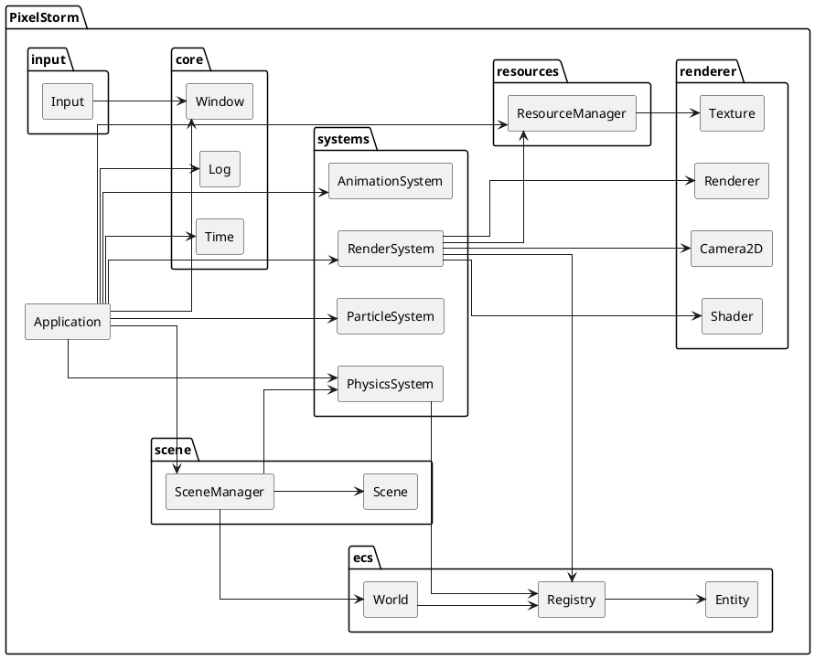

## 3.2 Decisiones de diseno

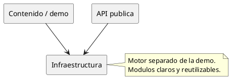

## 3.3 Core del motor

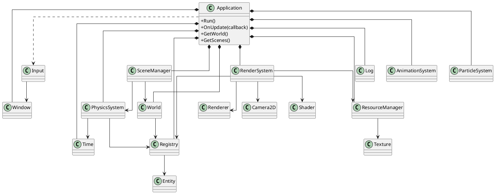

## 3.4 Pipeline del motor

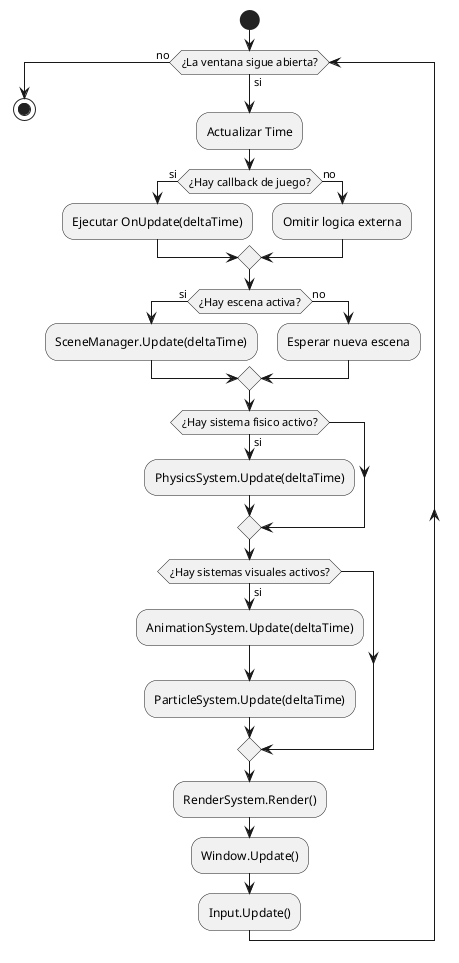

## 3.5 ECS y entidades

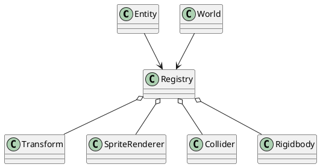

## 3.6 Sistema de renderizado

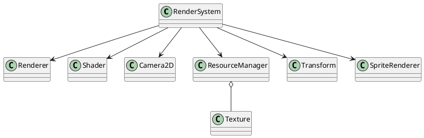

## 3.7 Gestion de recursos

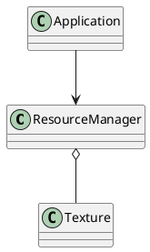

## 3.8 Sistema de input

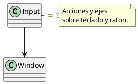

## 3.9 Sistema de escenas

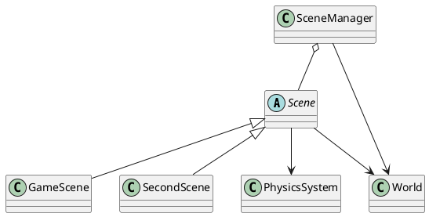

## 3.10 Fisica y colisiones

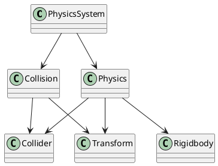

## 3.11 Particulas y animacion

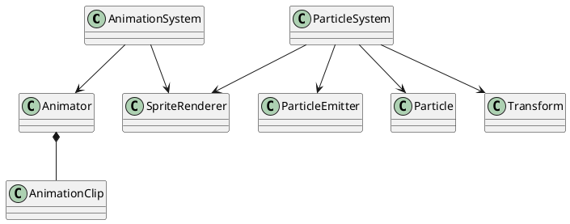

## 3.12 Integracion general

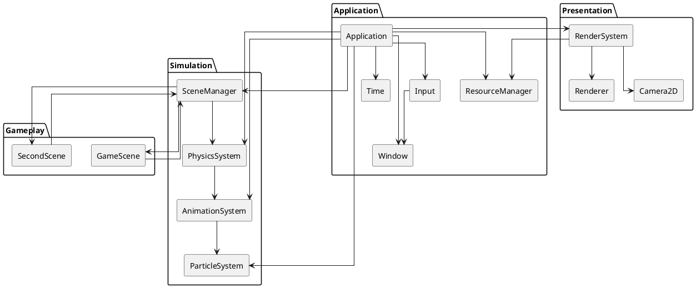
